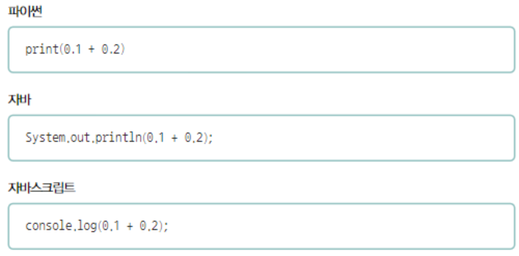

# Computer Structure (컴퓨터 구조)

## 기본 자료 구조 [▶︎ 🗒](basic.md)

- [컴퓨터가 이해하는 정보](./basic.md#컴퓨터가-이해하는-정보)
- [CPU](./basic.md#cpu)
- [메모리](./basic.md#메모리)
- [보조 기억장치와 입출력 장치](./basic.md#보조-기억장치와-입출력-장치)

---

## 질의응답

RAM과 하드디스크의 차이에 대해서 설명해주세요.

- RAM이 CPU가 실행할 프로그램을 저장하는 부품이라면 하드디스크는 전원이 꺼져도 보관할 프로그램을 저장하는 부품
- 휘발성 저장장치인 RAM은 전원이 꺼지면 저장된 내용을 잃지만, 하드디스크는 비휘발성 저장장치이기 때문에 전원이 꺼져도 내용이 남아있다는 차이가 있습니다.

base64 인코딩이 무엇이며 어디에서 base64 인코딩을 사용하는지 설명해보세요.

- 문자 뿐만 아니라 아스키 코드로 표현할 수 없는 이미지 등의 이진 데이터까지 아스키 형태의 문자로 표현하기 위해 사용하는 인코딩 방식
- 주로 이메일에서 첨부파일을 전송하거나 웹에서 이미지 및 파일 데이터를 텍스트 형식으로 포함할 때 사용

창현:

- Base64 인코딩은 바이너리 데이터를 텍스트로 변환하는 인코딩 방식입니다. 변환된 데이터는 일반 텍스트 형식으로 유지되며, 이로 인해 바이너리 데이터를 안전하게 전송하거나 저장할 수 있습니다.
- 이메일에서 첨부파일을 보낼 때 사용합니다. 이메일 프로토콜(SMTP)에서는 바이너리 데이터를 직접 전송할 수 없기 때문에 첨부파일을 Base64로 인코딩하여 전송합니다.
- JWT는 Base64 인코딩을 사용하여 서버와 클라이언트 간에 데이터를 안전하게 주고받을 수 있도록 설계되었습니다.

- Base64를 사용하지 않는 경우:

일반 파일 업로드 (웹사이트): 대부분의 웹사이트에서 파일을 업로드할 때는 Base64 인코딩이 필요하지 않습니다. 브라우저에서 파일을 서버로 업로드할 때는 파일을 그대로 바이너리 형식으로 서버에 전송합니다. 이 과정에서는 **enctype="multipart/form-data"**를 사용하여 바이너리 데이터를 전송하며, Base64로 인코딩할 필요가 없습니다.

유니코드란 무엇인지 설명하세요.

- 여러 국가의 언어나 이모티콘 등을 표현할 수 있는 통일된 문자 집합
- 유니코드마다 부여되어있는 고유한 수 , 코드 포인트를 어떻게 코드로 표현하는지에 따라 다양한 인코딩 방법을 구분 할 수 있습니다.

창현:

- \*유니코드(Unicode)**는 전 세계의 모든 문자를 통일된 방식으로 표현하기 위해 개발된 **문자 인코딩 표준\*\*입니다. 각 언어의 문자, 기호, 이모지 등을 고유한 코드로 정의하여 컴퓨터에서 일관되게 처리할 수 있도록 설계되었습니다.

코딩을 하다 한글이 깨지면 어떻게 하나요?

- 한글이 깨지는 경우는 컴퓨터가 이해할 수 있는 문자의 모음, 문자집합을 인식하지 못했거나, 문자집합을 코드로 표현하는 인코딩 방법을 인식하지 못한 경우입니다
- 따라서 다른 문자 집합을 지원하는 다양한 인코딩 방법을 시도해봐야 합니다

다음 소스코드의 결과는 모두 ‘0.300000000000000004’입니다. 그 이유에 대해 설명하세요.

- **부동소수점 수의 이진 표현**:
  컴퓨터는 실수를 이진수(2진법)로 표현합니다. 하지만 `0.1`이나 `0.2` 같은 소수는 이진수로 정확하게 표현할 수 없습니다. 이러한 숫자들은 이진수로 무한하게 반복되므로, 컴퓨터는 이러한 값을 근사치로 저장하게 됩니다.
- **정밀도 한계**:
  컴퓨터가 사용하는 부동소수점 표현(일반적으로 IEEE 754 표준)은 고정된 비트 수를 사용해 소수를 표현합니다. 이로 인해, `0.1 + 0.2`의 결과도 정확히 `0.3`이 아니라 근사치가 됩니다. 이 근사값을 10진수로 변환하면 `0.30000000000000004`로 나타나게 됩니다. 이는 매우 작은 오차이지만, 부동소수점 연산에서는 이러한 오차가 발생할 수밖에 없습니다.
- **언어 간 일관성**:
Python, Java, JavaScript 같은 언어들은 모두 IEEE 754 표준을 따르기 때문에 동일한 결과가 출력됩니다. 각 언어의 내부적인 소수점 처리 방식이 같기 때문에, 같은 수식을 계산할 때 동일한 오차가 발생합니다.

