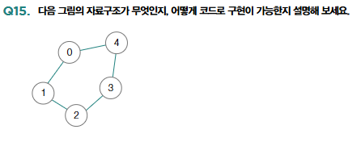

# Operating System (운영체제)

## 기본 자료 구조 [▶︎ 🗒](basic.md)

- [프로세스와 스레드](./basic.md#프로세스와-스레드)
- [동기화와 교착 상태](./basic.md#동기화와-교착-상태)
- [CPU 스케줄링](./basic.md#CPU-스케줄링)
- [가상 메모리](./basic.md#가상-메모리)
- [파일 시스템](./basic.md#파일-시스템)

---

## 질의응답

<details>
<summary>1. 다음 두 코드는 모두 정수형 리스트 ‘arr’을 인자로 전달받아 같은 작업을 수행하는 함수입니다. 두 코드 중 더 효율적이라고 판단하는 코드를 고르고 이 이유를 설명해보세요.</summary>

```python
def first(arr):
    n = len(arr)
    # 배열의 모든 요소를 순회합니다
    for i in range(n):
        # 현재 위치에서 인접한 요소들을 비교합니다
        for j in range(0, n - i - 1):
            # 만약 앞의 요소가 뒤의 요소보다 크면 두 요소를 교환합니다
            if arr[j] > arr[j + 1]:
                arr[j], arr[j + 1] = arr[j + 1], arr[j]
    return arr

def second(arr):
    n = len(arr)
    # 배열의 모든 요소를 순회합니다
    for i in range(n):
        for j in range(i + 1, n):
            for k in range(j + 1, n):
                # 세 개의 요소를 비교해 필요하면 교환합니다
                if arr[i] > arr[j]:
                    arr[i], arr[j] = arr[j], arr[i]
                if arr[i] > arr[k]:
                    arr[i], arr[k] = arr[k], arr[i]
                if arr[i] > arr[j]:
                    arr[i], arr[j] = arr[j], arr[i]
    return arr
```

<p> 
- 정답 : 첫 번째 함수인 `first`의 시간 복잡도는 \( O(n^2) \)입니다. 두 번째 함수인 `second`의 시간 복잡도는 \( O(n^3) \)입니다. 최대 \( n \)번의 연산이 필요한 반복문 3개가 중첩되어 있기 때문입니다. 따라서 `first`의 코드가 더 효율적으로 실행됩니다. </p> 
 </details> 
<details>
<summary>Q2. 시간 복잡도와 빅 오 표기법의 차이를 설명해 보세요.</summary>
<p>
- 정답 : 시간 복잡도는 입력의 크기에 따른 프로그램의 실행 시간 관계를 나타냅니다. 실행 시간은 연산 횟수에 비례하므로 입력의 크기에 따른 프로그램의 연산 횟수로 간주되기도 합니다. 빅 오 표기법은 함수의 접근적 상향을 나타내는데, 시간 복잡도를 표현하기 위해 자주 사용됩니다. 시간 복잡도를 표현할 때 빅 오 표기법이 사용된다면 입력에 따른 실행 시간의 접근적 상향을 의미하는 것입니다.

</p>
</details>

<details>
<summary>Q3. 인코딩된 값과 해시 값의 차이를 설명해 보세요.</summary>
<p>
- 정답 :인코딩은 데이터를 다른 방식으로 표현하기 위해 변환하는 것입니다. 인코딩된 값은 디코딩을 거쳐 다시 변환될 수 있습니다. 예를 들어 base64와 아스키 인코딩은 모두 컴퓨터가 이해하는 코드의 형식으로 변환될 수 있고, 그렇게 변환된 코드는 사람이 이해할 수 있는 데이터의 형태로 다시 디코딩할 수 있습니다.

반면, 해시 값은 해시 함수를 사용하여 고정 길이의 임의의 값으로 데이터를 변환한 결과를 말합니다. 해시 함수는 인코딩과는 달리 단방향 함수이기 때문에 데이터를 다시 변환할 수 없습니다. 또한 해시 함수는 임의의 길이의 데이터를 입력받아 고정된 길이의 해시 값을 출력하고, 입력값이 조금이라도 달라지면 해시 값도 완전히 다른 값으로 변경됩니다.

따라서 인코딩된 값은 주로 데이터를 다양한 형식으로 표현하기 위해 사용하고, 해시 값은 주로 데이터의 무결성을 검증하거나 데이터를 빠르게 검색하기 위해 사용합니다.

</p>
</details>
<details>
<summary>Q4. 스택을 배열로 구현해 보세요(push와 pop 연산은 반드시 구현해야 합니다).</summary>
<p>
- 정답 :
</p>

```python
class myStack:
    def __init__(self):
        self.items = []

    def push(self, item):
        self.items.append(item)

    def pop(self):
        if self.is_empty():
            return None
        item = self.items[-1]
        del self.items[-1]
        return item

    def is_empty(self):
        return len(self.items) == 0

s = myStack()
s.push('a')
s.push('b')
s.push('c')

print(s.pop())  # c
print(s.pop())  # b
print(s.pop())  # a
```

</details>

<details>
<summary>Q5. 큐를 배열로 구현해 보세요(인큐와 디큐 연산은 반드시 구현해야 합니다).</summary>
<p>
- 정답 :
</p>

```python
class myQueue:
    def __init__(self):
        self.items = []

    def enqueue(self, item):
        self.items.append(item)

    def dequeue(self):
        if self.is_empty():
            return None
        item = self.items[0]
        del self.items[0]
        return item

    def is_empty(self):
        return len(self.items) == 0

q = myQueue()
q.enqueue('a')
q.enqueue('b')
q.enqueue('c')

print(q.dequeue())  # a
print(q.dequeue())  # b
print(q.dequeue())  # c
```

</details>

<details>
<summary>Q6. 다음 그림의 자료구조가 무엇인지 설명하고, 간단한 코드로 구현해 보세요.(p.300)</summary>
<p>
- 정답 :
</p>

```python
class TreeNode:
    def __init__(self, value):
        self.value = value
        self.left = None
        self.right = None

#루트 노드 생성
root = TreeNode("a")

#왼쪽, 오른쪽 자식 노드 생성
root.left = TreeNode("b")
root.right = TreeNode("C")
```

</details>

<details>
<summary>Q7. Q6에서 구현한 자료구조의 모든 노드를 중위 순회하는 코드를 구현해 보세요. 어떤 순서로 방문하게 되나요?(p.300)</summary>
<p>
- 정답 : 다음과 같이 6번 질문에서 작성한 코드 하단에 코드를 추가합니다. 중위 순회는 왼쪽 서브트리 루트 노드→ 오른쪽 서브트리의 순으로 모든 트리노드를 방문하는 것을 의미합니다. 따라서 bac순으로 순회하게 됩니다.
</p>

```python
class TreeNode:
    def __init__(self, value):
        self.value = value
        self.left = None
        self.right = None

#루트 노드 생성
root = TreeNode("a")

#왼쪽, 오른쪽 자식 노드 생성
root.left = TreeNode("b")
root.right = TreeNode("c")

def inorder_traversal (node):
    if node:
        #왼쪽 서브트리를 먼저 방문
        inorder_traversal (node-left)
        # 현재 노드 방문
        print(node.value)
        #오른쪽 서브트리 방문
        inorder_traversal (node.right)

inorder_traversal (root)
```
</details>

<details>
<summary>Q8. 해시 충돌이 무엇이며, 어떻게 해시 충돌을 해결할 수 있는지 설명해 보세요.(p.282)</summary>
<p>
- 정답 : 해시 충돌이란 서로 다른 키에 대해 같은 해시 값이 대응되는 상황을 의미합니다. 해시 충돌은 체이닝과 개방 주소법 등으로 해결할 수 있습니다. 체이닝은 충돌이 발생한 데이터를 연결 리
스트로 추가하는 충돌 해결 방식이고 개방 주소법은 충돌이 발생한 공간이 아닌 다른 공간을 조사하여 데이터를 저장하는 충돌 해결 방식입니다.
</details>

<details>
<summary>Q9. 해시 테이블의 장점과 단점을 설명해 보세요.(p.281)</summary>
<p>
- 정답 : 해시 테이블의 장점은 데이터 검색 성능이 빠르다는 것입니다. 해시 테이블에 대한 키가 주어 졌다면 해시 테이블의 검색 성능은 O(1)로 매우 빠릅니다. 그러나 데이터가 저장될 공간을 미
리 확보해 두어야 하므로 메모리 공간이 많이 소요된다는 점이 단점입니다.
</details>

<details>
<summary>Q10. 배열 대신 연결 리스트를 사용하는 것이 프로그램의 성능에 유리한 경우가 있나요? 만약 그 렇다면 그 이유는 무엇인가요?(p.268)</summary>
<p>
- 정답 : 배열과는 달리 연결 리스트를 구성하는 모든 노드는 반드시 메모리 내에 순차적으로 저장되어 있을 필요가 없습니다. 따라서 연속적으로 구성되어 있는 데이터를 불연속적으로 저장할 때 유용하게 사용할 수 있고, 배열에 비해 삽입 및 삭제 연산에서 높은 성능을 보입니다.
</details>

<details>
<summary>Q11. 우선순위 큐는 어떻게 구현할 수 있는지 설명해 보세요.(p.276)</summary>
<p>
- 정답 : 우선순위 큐는 힙 자료구조로 구현됩니다. 힙은 주로 최댓값과 최솟값을 빠르게 찾는용도로 사용되는 완전 이진 트리의 일종입니다. 우선순위 큐는 FIFO가 아닌 우선순위가 높은 데이터 순으로 처리하기 때문에, 우선순위가 가장 높은 노드를 루트 노드로 삼는 힙으로 구현하기 에 용이합니다.
</details>

<details>
<summary>Q12. 깊이 우선 탐색과 너비 우선 탐색의 차이를 설명해 보세요.(p.322, p.325)</summary>
<p>
- 정답 : 깊이 우선 탐색과 너비 우선 탐색은 그래프를 탐색하는 기본적인 방법입니다. 깊이 우선 탐색은 그래프에서 더 이상 방문 가능한 정점이 없을 때까지, 최대한 깊은 자식 노드까지 탐색하
기를 반복하는 탐색 방법이고, 너비 우선 탐색은 인접한 모든 정점들을 방문하고, 방문한 정점들과 연결된 모든 정점들을 방문하기를 반복하는 탐색 방법입니다.
</details>

<details>
<summary>Q13. RB 트리란 무엇이며, 왜 RB 트리를 사용하는지 설명해 보세요.(p.305)</summary>
<p>
- 정답 : RB 트리는 이진 탐색 트리의 편향의 방지하기 위해 사용하는 자가 균형 이진 트리의 일종입니다. 이진 탐색 트리는 연산의 순서에 따라 편향된 트리가 될 수 있는데, 편향이 발생할 경우
탐색 속도가 O(n)으로 저하될 수 있습니다. RB 트리는 이를 방지하기 위해 모든 노드를 빨간색, 혹은 검은색으로 간주하고, 노드에 색을 칠하는 규칙과 노드에 칠해진 색을 기준으로 왼쪽 서브트리와 오른쪽 서브트리의 높이 균형을 맞춥니다.
</details>

<details>
<summary>Q14. B 트리란 무엇이며, 왜 B 트리를 사용하는지 설명해 보세요.(p.311)</summary>
<p>
- 정답 : B 트리는 여러 자식 노드를 가질 수 있는 다진 탐색 트리의 일종으로, 파일 시스템이나 데이터베이스와 같은 대용량 입출력 작업이 필요한 상황에서 주로 사용합니다.
</details>


<details>
<summary>Q15. 다음 그림의 자료구조가 무엇인지, 어떻게 코드로 구현이 가능한지 설명해 보세요.(p.318)</summary>
<p>
- 정답 : 제시된 자료구조는 정점과 그 정점들을 연결하는 간선으로 이루어진 그래프 자료구조입니다. 이는 이차원 행렬(이차원 리스트)이나 연결 리스트를 기반으로 구현이 가능합니다.
</details>
