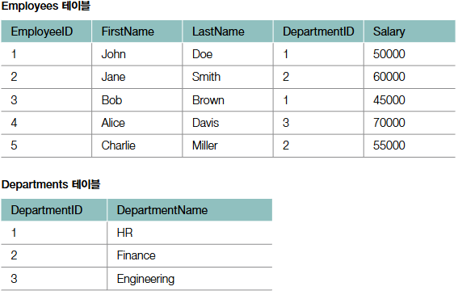
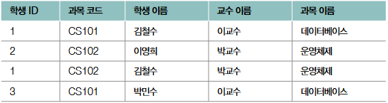

# Database (데이터베이스)

## 기본 자료 구조 [▶︎ 🗒](basic.md)

- [프로세스와 스레드](./basic.md#프로세스와-스레드)
- [동기화와 교착 상태](./basic.md#동기화와-교착-상태)
- [CPU 스케줄링](./basic.md#CPU-스케줄링)
- [가상 메모리](./basic.md#가상-메모리)
- [파일 시스템](./basic.md#파일-시스템)

---

## 질의응답

<details>
<summary>(517p) 데이터 저장과 관리가 목적이라면 단순히 파일 시스템을 사용해도 될 것입니다. 그럼 데이터 베이스를 사용하는 이유는 무엇일까요?</summary>

- 파일 시스템은 데이터베이스에 비해 데이터의 높은 일관성 및 무결성을 제공하기 어렵기 때문입니다. 파일 시스템에서는 여러 사용자나 프로그램이 동시에 데이터를 사용하는 경우, 레이스 컨디션 등의 문제로 인해 데이터 일관성이 깨지기 쉽습니다.
- 그리고 데이터 중복 저장으로 인한 저장 공간의 낭비가 발생하거나 데이터를 변경할 때, 연관된 모든 데이터를 수동으로 변경해야 하는 번거로움도 있습니다.
- 또한 정교한 검색이나 백업 및 복구 기능도 데이터베이스에 비하면 미흡합니다.
- 따라서 대량의 데이터를 관리하며 여러 사용자에게 제공해야 한다면 파일 시스템보다 데이터베이스를 사용하는 것이 더 효율적입니다.

</details>

<details>
<summary>(523p) 트랜잭션과 ACID가 무엇인지 설명해 보세요.</summary>
	
- 트랜잭션은 커밋이 발생하는 논리적 단위이며, ACID는 안전한 트랜잭션이 지켜야 할 4가지 특성인 원자성, 일관성, 격리성, 지속성을 의미합니다.
- 원자성은 트랜잭션의 모든 작업이 성공하거나 실패함을 보장하는 성질을 말하며,
- 일관성은 트랜잭션 전후에 데이터베이스의 일관된 상태를 유지하는 성질,
- 격리성은 동시에 수행되는 트랜잭션 간의 간섭이 불가능하도록 보장하는 성질,
- 지속성은 완료된 트랜잭션의 결과가 영구적으로 반영되는 성질을 말합니다.
</details>

<details>
<summary>(534p) 기본 키가 무엇이며, 어떤 조건을 만족해야 하는지 설명해보세요.</summary>
	
- 기본 키는 데이터베이스 테이블에서 각 행을 고유하게 식별하기 위해 선정된 키를 말합니다.
- 기본 키는 유일성을 갖추어 중복되지 않아야 하고,
- 반드시 값이 존재해야 하므로 NULL값을 가질 수 없습니다.
- 또한 행의 식별하기 위한 최소한의 정보로 구성되어야 합니다.
</details>

<details>
<summary>(541p) 참조 무결성 제약 조건에 대해 설명해 보세요.</summary>
- 참조 무결성 제약 조건이란 외래 키를 통해 테이블 간의 참조 관계에서 데이터의 일관성을 유지하기 위한 조건을 말합니다. 외래 키는 참조하는 테이블의 기본 키 와 같은 값을 갖거나 NULL 값을 가져야 합니다.
</details>

<details>
<summary>다음 질문 5개는 다음 테이블을 토대로 답변하는 질문입니다.</summary>
- 다음은 어떤 기업의 사업부서 및 직원에 대한 정보를 나타내는 테이블입니다.
    
    
    
- Employees 테이블
    - 직원의 ID(EmployeeId)
    - 이름(FirstName)
    - 성(LastName)
    - 사업부서 ID(DepartmentId)
    - 연봉(Salary)이 저장되어 있고,
- Departments 테이블
    - 사업부서의 ID(DepartmentId)
    - 부서명(DepartmentName)
- 두 테이블을 기반으로 관련 질문에 답변해보세요.
</details>

<details>
<summary>(559p) 모든 직원의 이름을 조회하는 SQL문을 작성해 보세요.</summary>
```SQL
SELECT FirstName, LastName
	FROM Employess;
```
</details>

<details>
<summary>(556p) 전 직원의 급여를 10% 인상하는 SQL문을 작성해 보세요.</summary>
```SQL
UPDATE Employess
	SET Salary = Salary * 1.10;
```
</details>

<details>
<summary>(550p) Employees 테이블의 DepartmentID가 Departments 테이블의 DepartmentID를 참조하는 외래 키를 추가해 보세요. 참조하는 테이블의 레코드가 삭제될 경우에는 참조한 테이블의 레코드가 함께 삭제되어야 하며, 참조하는 테이블의 레코드가 수정될 경우에는 참조한 테이블의 레코드를 NULL로 설정해야합니다.</summary>
```SQL
ALTER TABLE Employees
	ADD FOREIGN KEY (DepartmentID)
	REFERENCES Departments(DepartmentID)
	ON DELETE CASCADE
	ON UPDATE SET NULL;
```
</details>


<details>
<summary>(579p) Employees 테이블과 Departments 테이블을 INNER 조인하여 모든 직원의 이름과 부서 이름을 조회하는 SQL문을 작성해 보세요.</summary>
```SQL
SELECT Employees.FirstName, Employees.LastName, Departments.DepartmentName 
	FROM Employees
	INNER JOIN Departments ON Employees.DepartmentID = Departments.DepartmentID;
```
</details>


<details>
<summary>(579p) Employees 테이블과 Departments 테이블을 INNER 조인하여 Finance 부서의 직원 이름과 급여를 조회하는 SQL문을 작성해 보세요.</summary>
```SQL
SELECT Employees.FirstName, Employees.LastName, Departments.Salary 
	FROM Employees
	INNER JOIN Departments ON Employees.DepartmentID = Departments.DepartmentID;
	WHERE Departments.DepartmentName = 'Finance';
```
</details>

<details>
<summary>(577p) INNER 조인과 OUTER 조인의 차이점을 설명해 보세요.</summary>
- INNER 조인은 조인 조건을 만족하는 행들만 결과에 포함되며, 공통된 데이터가 있는 경우에만 데이터를 추출합니다.
- OUTER 조인은 공통된 값이 없는 행도 포함하여 반환합니다. 가령 OUTER 조인의 일종인 LEFT OUTER 조인은 왼쪽 테이블의 모든 행과 오른쪽 테이블의 일치하는 값을 반환하고, 일치하지 않는 경우 NULL을 반환합니다.
- 또 다른 OUTER 조인인 RIGHT OUTER 조인은 오른쪽 테이블의 모든 행과 왼쪽 테이블의 일치하는 값을 반환하고, 일치하지 않는 경우 NULL을 반환합니다.
- FULL OUTER 조인은 양쪽 테이블의 모든 행을 반환하고, 어느 한 쪽에서 일치하는 값이 없는 경우 NULL을 반환합니다.
</details>

<details>
<summary>(584p) SQL에서 뷰를 사용하는 목적을 설명해 보세요.</summary>
- 뷰는 SQL 쿼리의 단순화 및 재사용성을 위해 사용합니다. 복잡한 쿼리를 자주 실행해야 하는 경우, 뷰를 생성하여 동일한 결과를 간단하게 얻을 수 있습니다. 뷰는 여러 테이블을 조인하거나 복잡한 조건을 포함한 쿼리를 하나의 뷰로 만들어 반복적인 쿼리 작성을 줄이고자 할 때, 또 특정 사용자에게 테이블의 특정 데이터만을 보여주고자 할 때도 사용할 수 있습니다.
</details>

<details>
<summary>(587p) 인덱스란 무엇이며, 인덱스를 통해 어떻게 성능을 향상시킬 수 있는지 설명해보세요.</summary>
- 인덱스는 특정 테이블 열에 대한 자료구조로, 검색 속드를 향상시키기 위해 사용합니다. 책의 찾아보기와 유사한 개념으로, 인덱스를 통해 원하는 데이터를 빠르게 조회할 수 있습니다.
- 인덱스를 생성하면 해당 테이블의 열 값들이 정렬된 형태로 저장되므로 테이블 전체를 탐색하지 않고도 빠르게 데이터를 찾을 수 있어 검색 성능이 향상됩니다.
</details>

<details>
<summary>(589p) 인덱스에는 B 트리, 혹은 B 트리의 변형인 자료구조가 사용됩니다. 그 이유를 설명해 보세요.</summary>
- B 트리 혹은 B+ 트리와 같은 B트리의 변형은 대용량 데이터에 대한 빠른 탐색에 특화된 자료구조이기 때문입니다. B트리는 균형잡힌 트리 구조로써 데이터가 정렬된 상태로 저장되고, 각각의 노드가 여러 개의 자식을 가질 수 있어 탐색을 위한 연산 횟수가 일반적인 트리에 비해 적습니다. 이렇게 원하는 레코드를 빠르게 탐색할 수 있기 때문에 인덱스에서 주로 사용됩니다.
</details>

<details>
<summary>(592p) 인덱스가 오히려 성능을 악화시키는 사례도 있습니다. 이러한 성능 악화는 어떤 상황에서 발생하는지, 그래서 인덱스를 언제, 어떻게 사용해야 하는지에 대해 설명해 보세요.</summary>

- 인덱스를 사용하면 SELECT 연산의 성능은 향상시킬 수 있지만, INSERT나 UPDATE, DELETE 연산에서는 성능을 저하시킬 수 있습니다. 새로운 데이터를 삽입하거나 기존 데이터를 수정/삭제하는 경우에는 인덱스도 함께 생신해야 하기 때문입니다.
- 따라서 인덱스는 데이터가 많고 조회가 빈번한 테이블에 사용하며, 중복 데이터가 많지 않은 열이나 JOIN, WHERE, ORDER BY 에서 자주 참조되는 열에 생성하는 것이 
효율적입니다.

</details>

<details>
<summary>(598p) 다음에 제시된 테이블이 가지고 있는 문제가 어떤 것인지 설명하고, 그 해결 방법을 제시해 보세요.</summary>

- 동일한 과목과 교수 정보가 여러 행에 걸쳐 중복 저장되어 있는 것으로 미루어 보아, 이 테이블은 정규화되어 있지 않습니다. 이 문제를 해결하기 위해서는 과목에 대한 정보와 학생에 대한 정보를 분리하여 정규화해야 합니다.
- 제시된 테이블을 과목 테이블과 학생 테이블로 분리할 수 있는데요. 예를들어 과목 테이블에는 과목 코드와 과목 이름, 교수 이름을 저장하고, 학생 테이블에는 학생 ID와 과목 코드를 저장하면 됩니다.
</details>

<details>
<summary>(604p) 데이터 관리에 있어 때로는 정규화가 필요하지 않을 때도 있습니다. 정규화가 필요하지 않은 상황은 어떤 상황일까요?</summary>
- 정규화가 항상 최선은 아닙니다. 정규화는 데이터 일관성과 무결성을 높이지만, 테이블을 많이 쪼개다 보면 빈번해진 조인 연산으로 인해 검색의 성능이 저하될 수 있기 때문입니다.
- 따라서 검색의 성능이 중요한 경우에는 데이터 중복과 연산의 번거로움을 감수하더라도 하나의 테이블로 관리하는 역정규화를 고려할 수 있습니다.
- 예를 들어 NoSQL 데이터베이스에서는 성능최적화를 위해 기본적으로 데이터를 정규화하지 않습니다.
</details>

<details>
<summary>(605p) NoSQL 데이터 베이스란 무엇이며, 관계형 데이터베이스와 어떤 차이점이 있는지 설명해보세요.</summary>

- 관계형 데이터베이스는 테이블 기반의 구조로서 스키마가 고정되어 있는 반면, 비관계형 데이터베이스인 NoSQL 데이터베이스는 데이터의 저장 및 관리를 위해 고정된 스키마가 없고, 수평 확장이 용이한 구조를 가지고 있습니다.
- NoSQL 데이터베이스는 키-값, 도큐먼트, 칼럼패밀리, 그래프 등의 다양한 형태로 저장할 수 있습니다.
  
</details>

<details>
<summary>(608p) 관계형 데이터베이스와 비교해 NoSQL데이터 베이스는 어떤 상황에서 유리한가요? 또 어떤 상황에서 불리한가요?</summary>

- NoSQL데이터베이스는 대규모의 비정형 데이터를 처리할 때 높은 확장성과 빠른 읽기/쓰기 성능이 필요할 때 유리합니다.
- 그러나 엄격한 트랜잭션 관리나 데이터 일관성 보장, 관계형 데이터베이스 모델링이 필요한 애플리케이션에서는 관계형 데이터베이스가 더 적합하므로 NoSQL 데이터베이스는 불리할 수 있습니다.
  
</details>

<details>
<summary>(616p) Redis가 캐시 서버로써 동작하는 부차적인 데이터베이스로 유용하게 사용되는 이유는 Redis의 어떤 특성떄문인지 설명해보세요.</summary>

- 우선 Redis는 인 메모리 데이터베이스이기 때문에 디스크 접근시간을 단축할 수 있습니다.
- 또한 Redis는 여러 자료구조를 지원하는 키-값 데이터베이스로써, RDBMS보다 정형화되있지 않은 데이터에 대한 빠른 입출력이 가능합니다.
- 따라서 RDBMS 등을 주요 데이터베이스로 삼고, Redis를 캐시 역할을 수행하는 부차적인 데이터베이스로 삼으면 주요 데이터베이스의 입출력 성능을 상당 부분 보강할 수 있습니다.
  
</details>

<details>
<summary>(625p) 데이터베이스 샤딩이 무엇인지 설명해보세요.</summary>

- 데이터베이스 샤딩은 샤드라는 단위로 여러 데이터베이스 서버에 걸쳐 테이블을 분할하여 저장하는 기술을 의미합니다. 여러 서버에 분산되어 저장되는 특성 덕분에 데이터베잇에 대한 부하 분산 효과를 얻을 수 있습니다.

</details>
